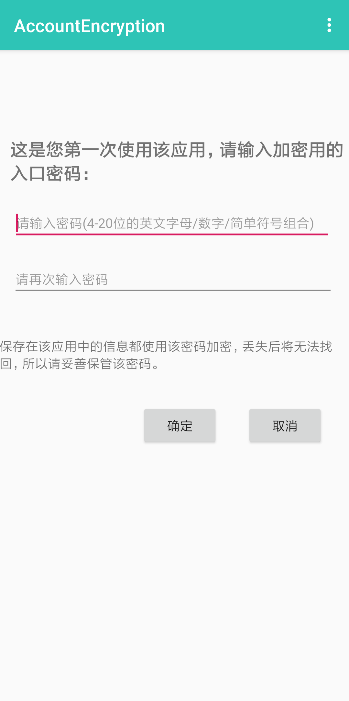
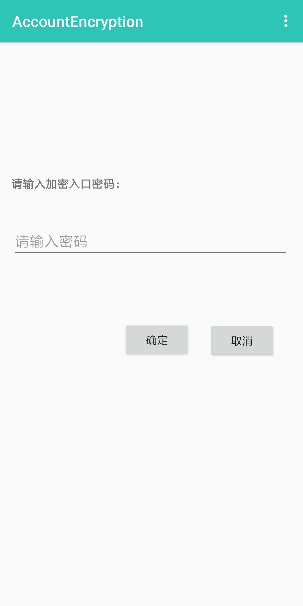
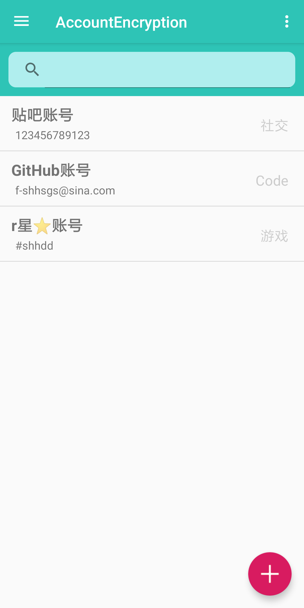
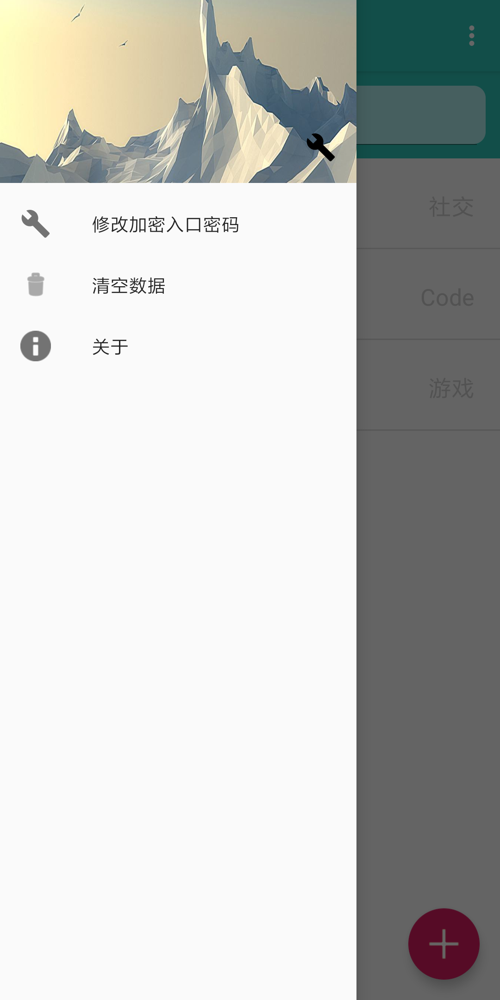
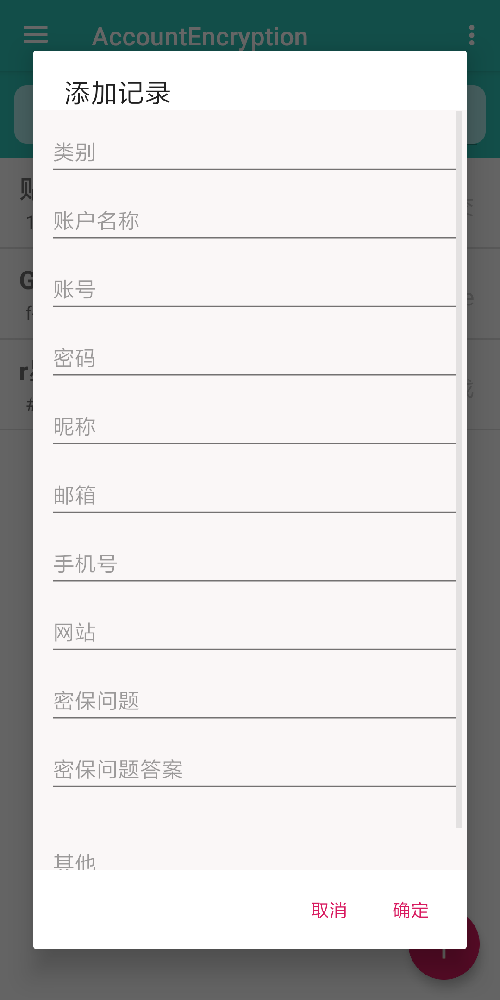
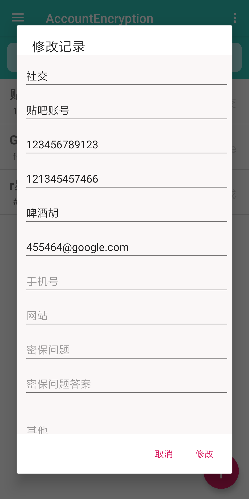
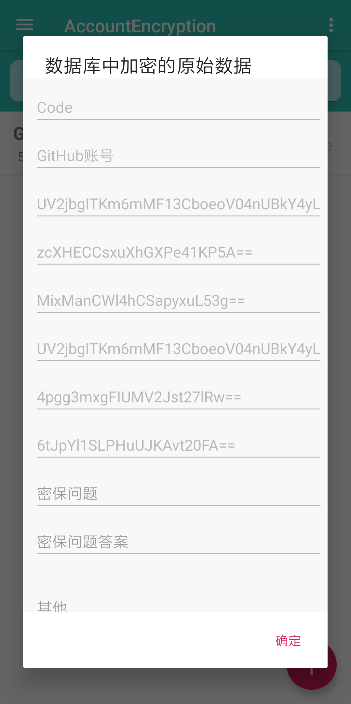
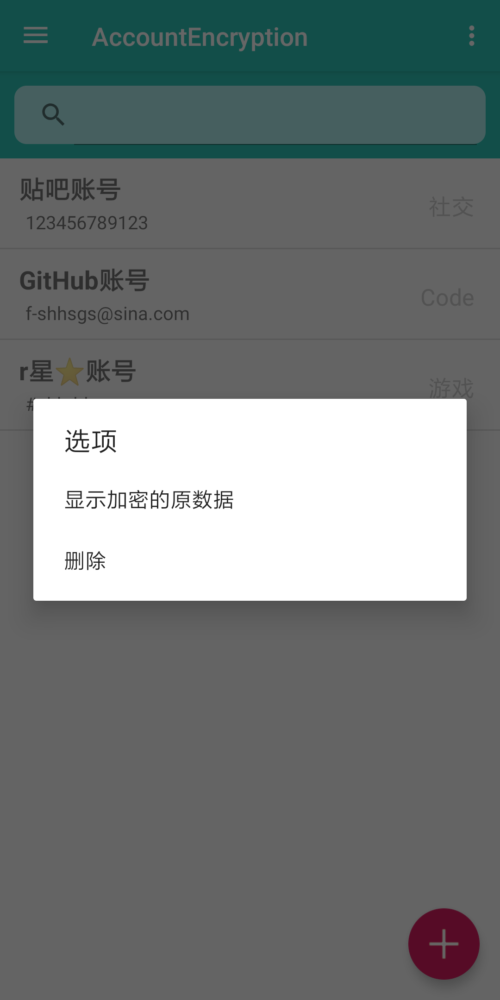

# AccountEncryption_Android

本地账号信息加密存储APP

Android_9.0  Version_1.0

入口密码使用MD5Hash加密，账号记录信息使用AES128ECBPKCS5加密

本APP由-Ultronxr-开发

© 20190530

[https://github.com/Ultronxr/AccountEncryption_Android](https://github.com/Ultronxr/AccountEncryption_Android)

# APP截图

